<h1 align="center">CCTV for Minecraft</h1>

<p align="center">
  <b>Live security cameras for your Fabric 26.3 server — watched in any web browser, drawn like the game itself.</b><br>
  <sub>Server-side only · no client mod · no bot account · no GPU on the server</sub>
</p>

<!-- badges:start -->
<p align="center">
  <a href="https://github.com/DarienRahl/CCTV_Farbic/releases/latest"></a>
  
  
  <a href="#roadmap"></a>
  <a href="LICENSE"></a>
</p>
<!-- badges:end -->

<p align="center">
  <a href="docs/media/showcase.mp4">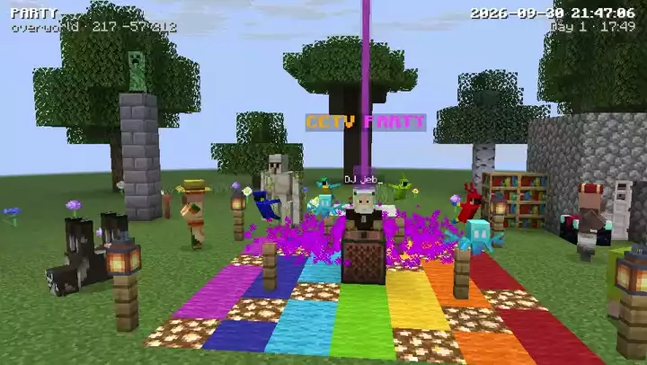</a><br>
  <sub>▶ <a href="docs/media/showcase.mp4"><b>Watch it with sound</b></a> · a party that gets out of hand, filmed by a CCTV camera and recorded with the viewer's own ⏺ Record button</sub>
</p>

<p align="center">
  <a href="#quick-start"><b>Quick start</b></a> ·
  <a href="#what-you-get">Features</a> ·
  <a href="#gallery">Gallery</a> ·
  <a href="#commands">Commands</a> ·
  <a href="#browser-viewer">Viewer</a> ·
  <a href="#configuration--configcctvconfigjson">Configuration</a> ·
  <a href="#roadmap">Roadmap</a> ·
  <a href="#faq">FAQ</a>
</p>

Place a camera with `/cctv create lobby`, open `http://your-server:8100/cam/lobby` and watch it live — 20 updates
a second, in any browser, on any device. Blocks, mobs, holograms, particles, the sky and the game's font are
drawn like Minecraft 26.3 from its own `client.jar`, with 3D sounds and background music, shaders and post
effects, a video wall, recordings and timelapses, and your worlds' custom paintings, discs and resource packs.

## What you get

<table>
<tr>
<td width="33%" valign="top">

### 🧩 Nothing to install for players
Vanilla clients join as usual. The mod runs only on the server; nobody has to be logged in for a camera
to work.

</td>
<td width="33%" valign="top">

### 🖥️ No GPU on the server
The server sends compact block, light and entity data. All drawing happens in the browser with WebGL2,
off the main thread where it can.

</td>
<td width="33%" valign="top">

### 🎯 1:1 with Minecraft 26.3
Block meshes, smooth lighting, the lightmap, fog, sky, weather and mob models are ported from the game's
own code and read from its `client.jar`. **Every particle type** of the game is there too, from the
Nether's ash to glyphs flying into enchanting tables. Every build is checked against the game's own
pictures of five scenes.

</td>
</tr>
<tr>
<td valign="top">

### 🐑 Every mob, animated
All mob models with their variants, armour and equipment, the game's keyframe animations, entity events,
shadows and name tags in the game's font — and the holograms, mannequins and shelves servers decorate with.
Players draw bows, raise shields, wear hats and carry parrots, with their team colours over their heads.
Minecarts ride their rails, stacks pile up on the ground and the world border glows as you come near.
Villagers hold what they trade, witches sip their potions and the warden's heart beats faster as it gets angry.
Armour stands keep the poses they were given.

</td>
<td valign="top">

### 🔊 Sounds in 3D
Steps, mobs, doors, explosions, note blocks, **music discs with "Now Playing"**, rain, caves, biome
ambience and the game's **background music** with its **Now Playing toast** — even the playlists of
[The Immersive Music Mod](https://github.com/DarienRahl/timm) when the server has it.

</td>
<td valign="top">

### 🌄 1024-block view distance
Terrain in unloaded chunks comes from the region files (like Bobby), with distance fog you can choose.

</td>
</tr>
<tr>
<td valign="top">

### ✨ Shaders and 11 post effects
Sun shadows, waving plants, water reflections, sun rays — plus cinematic, noir, thermal, night vision,
VHS, fisheye and more. Your own GLSL too.

</td>
<td valign="top">

### 🎨 Your world's own packs
Data packs, the world's `resources.zip` and the server resource pack are used like the game uses them:
custom paintings, discs, blocks and sounds just work.

</td>
<td valign="top">

### ⚡ Light on the server
About a millisecond per camera tick, a browser-side section cache and a stream that never outruns a slow
connection. A camera nobody watches costs nothing.

</td>
</tr>
</table>

## Gallery

<table>
<tr>
<td colspan="2">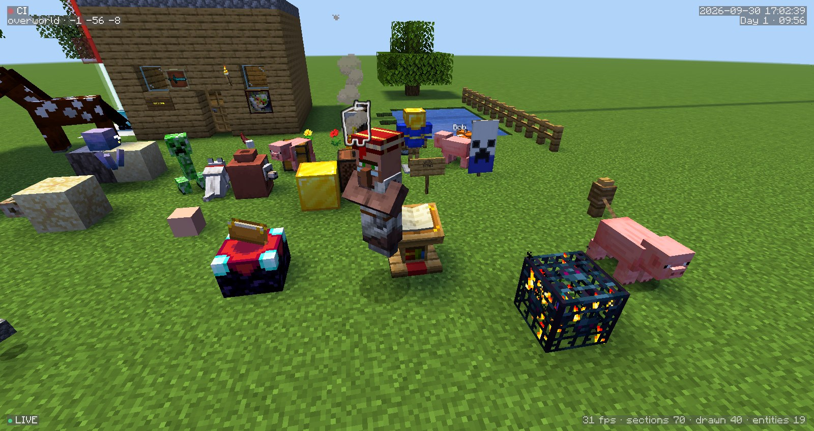<br>
<sub><b>A camera in the shaders mode</b> — a house, a pond, villagers, a horse, a campfire and an enchanting table.</sub></td>
</tr>
<tr>
<td colspan="2">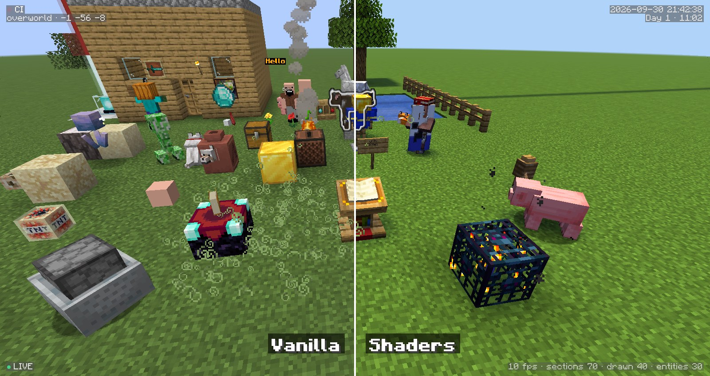<br>
<sub><b>Vanilla or shaders</b> — the game's look, or sun shadows, waving plants, reflections and sun rays. Both run in any WebGL2 browser.</sub></td>
</tr>
<tr>
<td width="50%">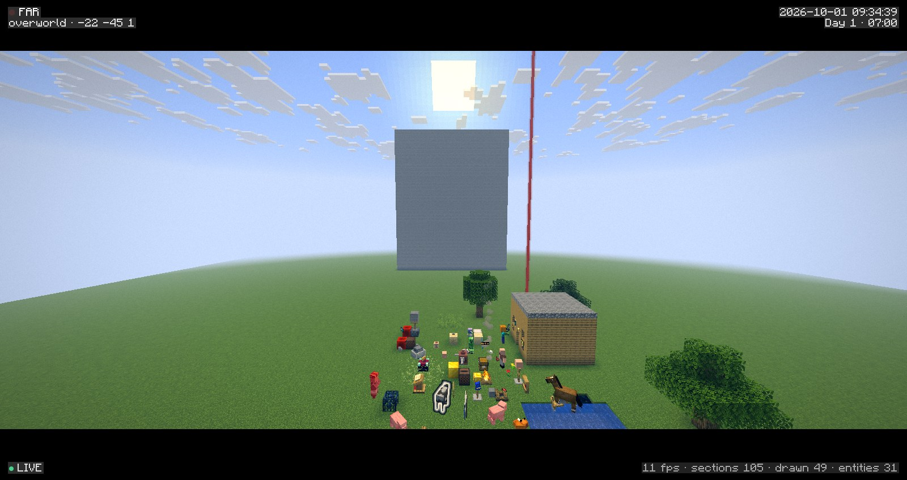<br>
<sub><b>Far view</b> — up to 1024 blocks, beacon beams, clouds and distance fog.</sub></td>
<td width="50%">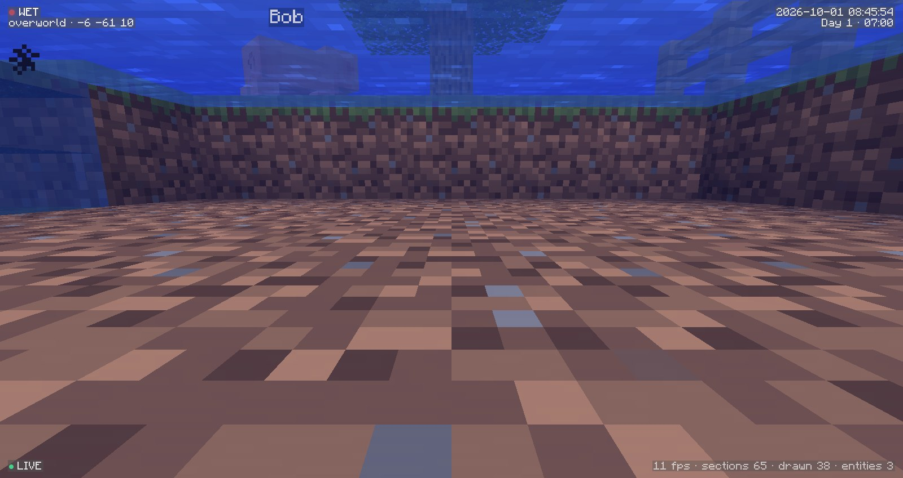<br>
<sub><b>Under water</b> — the water fog and the underwater overlay of the game.</sub></td>
</tr>
<tr>
<td colspan="2">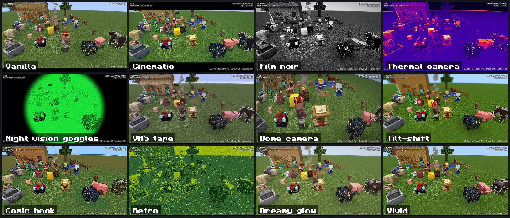<br>
<sub><b>Built-in post effects</b> — Settings › Post effect, or a default for everybody in the config.</sub></td>
</tr>
<tr>
<td colspan="2">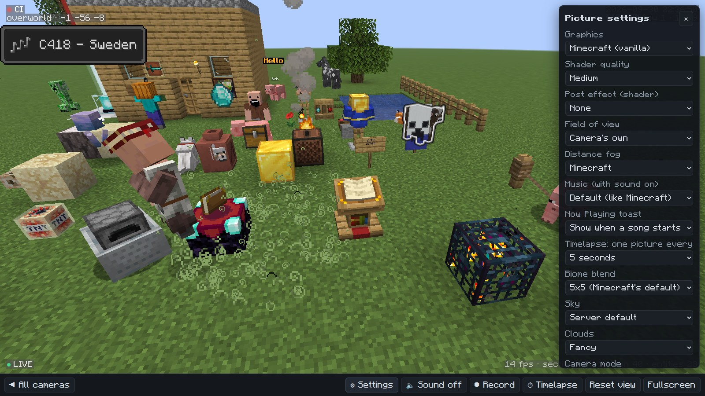<br>
<sub><b>The game's font everywhere</b> — the HUD, buttons and settings, and the Now Playing toast of the background music.</sub></td>
</tr>
<tr>
<td colspan="2">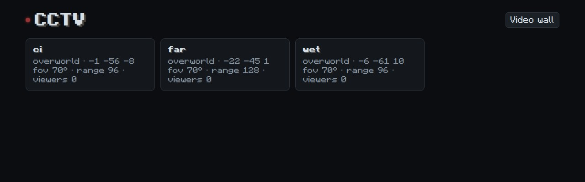<br>
<sub><b>Camera list</b> — every camera of the server, or all of them at once as a video wall.</sub></td>
</tr>
</table>

<sub>The video and all pictures are made by CI from a real 26.3 server running the latest release (the
<code>screenshots</code> workflow; the party is <code>.github/e2e/showcase.py</code>, filmed in slow motion because CI draws
without a GPU, then sped up again with its sounds).</sub>

## Quick start

```text
1. Put cctv-fabric-<version>.jar and Fabric API into the server's mods/ folder, start the server.
2. In game (as an operator):   /cctv create lobby
3. Open in a browser:          http://your-server:8100/cam/lobby
```

Open port **8100/TCP** if players should watch from outside. `http://your-server:8100/` shows every camera
at once as a video wall.

<details>
<summary><b>Everything it draws</b> (the long list)</summary>

- **Players do not need the mod.** They join with a normal vanilla client.
- **No extra Minecraft account and no bot.** Nobody has to be logged in for a camera to work.
- **The server renders nothing and needs no GPU.** It only sends light data: blocks, light, biomes
  and entity positions 20 times a second. All rendering happens in the browser (WebGL2).
- **Looks 1:1 like Minecraft 26.3.** Block meshes are built with the same algorithm as the client
  (model variants, plant offsets, *smooth lighting* with AO, face shading, 5×5 biome colour
  blending, fluids). Light, fog, sky, sun, moon phases, stars, sunrises and sunsets, clouds, rain,
  snow, thunderstorms with lightning and sky flashes, the End sky and **End flashes** are computed
  from the same environment attributes as in the game.
- **Every mob with its real model.** Model geometry is taken from `client.jar` (happy ghast, horses
  with coats and markings, wolves, cats, villagers with professions, cold/warm variants…), together
  with saddles, dyed and trimmed armour, elytra, collars, wool, harnesses and glowing eyes; maps show
  their pictures in item frames. Players have their own
  skins (or the game's default skin for their UUID) with the skin layers they chose, their capes
  (swinging as they move), and walk, sneak, swim and glide like in the game. Mobs play the game's
  own keyframe animations (sniffer, warden, frog, camel…) and react to entity events (attacks,
  sheep eating grass, wolves shaking off water); burning entities are wrapped in flames.
- **Blocks come alive.** Signs with their text, banners with patterns, decorated pots, player
  heads with skins, beacon beams, end portals with the game's own shader, food on campfires, the
  enchanting table's book turning to players, and every particle of the game: torch and campfire
  flames, drips, falling leaves, pieces of broken blocks, explosions, potions bursting, glyphs flying
  into enchanting tables, redstone dust, sculk charges and shrieks, vibrations flying to their
  listener, sonic booms, the totem of undying, vaults calling their players and the Nether's ash and
  spores. Chests and shulker boxes open, bells swing, blocks being mined crack and spawners spin their
  mobs.
- **Sounds.** With the 🔈 button the viewer plays what a player at the camera would hear: mobs, steps,
  doors, chests, blocks breaking, explosions, note blocks and jukeboxes, thunder, rain, crackling fires
  and bubbling lava, cave and biome ambience, the underwater hum, in 3D and fading with distance like
  the game's sound engine.
- **Huge view distance.** A camera also sees terrain in unloaded chunks (read from the region files
  off the main thread, much like Bobby does), up to 1024 blocks.
- **Shaders and custom skies.** An optional "shaders" mode (sun shadows, waving plants, water with
  reflections, glow, sun rays), custom GLSL post effects and sky boxes, with defaults for every
  viewer set by the admin.

</details>

## Roadmap

<!-- roadmap:start -->
<p align="center">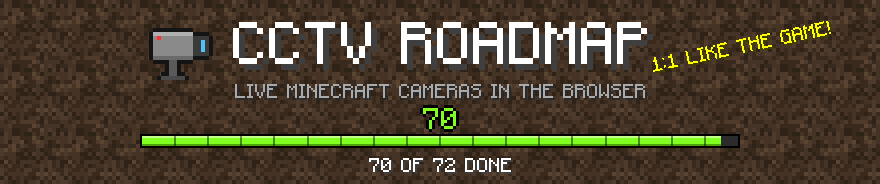</p>

What is done and what comes next, milestone by milestone (the full plan with its principles is in
[docs/ROADMAP.md](docs/ROADMAP.md)).

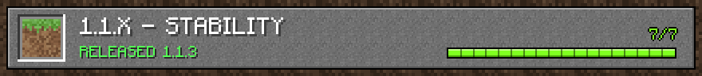

<details>
<summary><b>1.1.x — stability</b> · released 1.1.3 · 7 of 7 done</summary>

- [x] Far terrain without holes in cliffs and hillsides (buried check looks at the neighbouring chunks towards the camera; nothing is skipped for cameras underground)
- [x] Flow control: sections are streamed at the speed of the connection
- [x] Turned view stays inside the streamed area
- [x] A broken block model no longer removes its section; solid far leaves; no plants in the camera's own block
- [x] Players walk, sneak, swim, crawl and glide like in the game; default skins by UUID
- [x] Name tags 1:1 (game font, scale, background, see-through text, lighting, visibility rules)
- [x] **1.1.3:** cameras stream again after a quiet minute (the empty server paused itself; a watched camera now keeps it awake); `/api/status` shows the session state

</details>

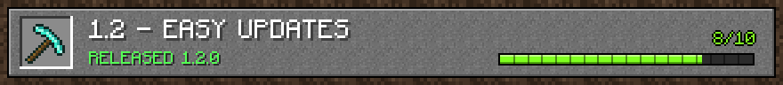

<details>
<summary><b>1.2 — easy updates</b> · released 1.2.0 · 10 of 10 done</summary>

- [x] `docs/UPDATING.md`: the step-by-step update procedure and the list of game touch points
- [x] **Update workflow** (`update-minecraft.yml`): for a given game version it resolves Fabric Loader, Fabric API and Loom, bumps `gradle.properties` and `fabric.mod.json`, builds, runs the server test and pushes an `update/<version>` branch with a report
- [x] **Ported-classes diff**: `docs/ported-classes.txt` lists the game classes the viewer ports; the inspect workflow decompiles them for two versions and prints the diff
- [x] **Soft failures**: every feature that touches the game API catches `LinkageError`, logs once and switches itself off, so a newer game version degrades instead of crashing
- [x] **Keyframe animations from the game**: every `AnimationDefinition` in `client.jar` is read at run time and played by a port of `KeyframeAnimation`; the server reports running `AnimationState`s and entity events. Warden, sniffer, frog, camel, armadillo, bat, breeze, creaking, rabbit, copper golem, nautilus and baby axolotl move like in the game
- [x] Entity names from the game's language file, in any game language (`language` setting)
- [x] **Mobs the viewer does not know yet** (a newer game version's) are drawn with the game's model layer and texture found by its naming (`<name>#main`, `textures/entity/<name>/…`) and a generic walk, instead of a box
- [x] **Automatic entity mapping**: `EntityRenderers` and the renderers are read from `client.jar` (bytecode) to map each entity type to its model layers, textures and shadow; mobs the hand-written table does not know are drawn with them (the table only overrides)
- [x] Client-side animations from entity events: iron golem, ravager, hoglin and zoglin attacks, the ravager's stun and roar, sheep eating grass, wolves shaking off water and begging, goats ramming (events are queued, so none is lost when the viewer draws fewer frames than it gets)
- [x] More of them: evoker fangs biting and the evoker's casting hands with their spell particles, illagers celebrating and holding or loading crossbows, horses and donkeys rearing, grazing and swishing their tails, foxes sitting, sleeping, stalking and pouncing with the item in their mouth (and its crumbs), pandas sitting with bamboo, rolling, lying on their back and sneezing, the iron golem offering a poppy (the amounts the game's entity tick computes are sent and interpolated, so the poses move like the game's)

</details>

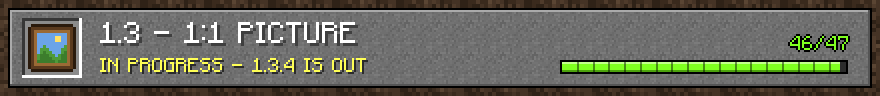

<details open>
<summary><b>1.3 — 1:1 picture</b> · in progress - 1.3.4 is out · 51 of 51 done</summary>

- [x] **Reference renders in CI**: a Fabric client game test (`src/gametest`, run under a virtual display with Mesa's software Vulkan) builds a scene in single player and takes the game's own picture from a spectator's eyes, a camera is put at the same eyes and the viewer takes its picture; both are published side by side with a difference score in the job summary and the `reference-renders` artifact
- [x] **Signs and hanging signs** with their text in the game font (text sent by the server; boards and beds are block models in 26.3 and were already drawn)
- [x] **Banners with patterns** (and their sway), player heads with their owner's skin, pottery sherds on decorated pots
- [x] **Beacon beams** (BeaconRenderer: the beam sections the beacon computed, the turning beam and its glow, wider far away; re-read every 40 ticks like the beacon's own checks)
- [x] **End portal and end gateway** with the game's own `rendertype_end_portal` shader (15 and 16 layers over the End sky texture)
- [x] Food cooking on campfires (CampfireRenderer)
- [x] **Books on enchanting tables** (turning to the nearest player, opening and flipping pages) **and lecterns**
- [x] **Mobs in spawners** (SpawnerRenderer: the spawner's mob small, tilted and spinning while a player - the camera - is near, with its smoke and flames; trial spawners by their state)
- [x] **Block breaking progress**: the cracks of blocks players are mining (the destroy stages drawn over the block's own model like SheetedDecalTextureGenerator and the crumbling pipeline)
- [x] **Conduits** (ConduitRenderer: the shell, or the turning cage, wind and eye of an active conduit, which the viewer works out from the water and prismarine around it like the client), **end gateway beams** after a teleport (TheEndGatewayRenderer), the item in **suspicious sand and gravel** being brushed (BrushableBlockRenderer)
- [x] **Shields with their patterns** (ShieldSpecialRenderer: the base colour and banner patterns, held, dropped and in item frames; items in the left hand mirrored like ItemTransform)
- [x] **Chests, ender chests and shulker boxes open, bells swing, note blocks show their notes** from the server's block events (ChestLidController, ShulkerBoxBlockEntity, BellBlockEntity, NoteBlock)
- [x] **Pistons move** the blocks they push and pull (PistonMovingBlockEntity, PistonHeadRenderer: the head short while it slides through the base, a retracting piston's base in place)
- [x] **Sounds**: the sounds the server sends players (mobs, steps, blocks, doors, explosions, note blocks, jukeboxes) and the ones the client makes from level events, played in 3D like the game's SoundEngine (sound files from the game's asset index, downloaded and cached by the server; a button turns them on in the viewer)
- [x] Sounds the client makes itself: lightning thunder and impact (LightningBolt), the crackle and bubbling of fire, campfires, furnaces, candles, lava, flowing water and nether portals (animateTick)
- [x] **Ambience**: rain on the blocks around the camera (ClientLevel.tickWeatherEffects, with its seeded random), the biome's loops, additions and cave sounds in the dark (BiomeAmbientSoundsHandler, from the server's environment attributes), underwater loops and additions, bubble columns, End flashes
- [x] Client-only block and entity sounds: desert sand and dry plants, leaves, pale hanging moss, eyeblossoms, creaking hearts, dried ghasts, respawn anchors, bubble columns, potent sulfur, firefly bushes, vaults and trial spawners; blazes burning, phantom wing flaps, the warden's heartbeat, armour stand hits, zombie villager cures, evoker fang bites
- [x] **Guardians fire their beams** (GuardianRenderer.renderBeam, charging from purple to yellow, with the bubbles along it and GuardianAttackSoundInstance), their spikes and tail move like GuardianModel; **endermen scream** (the jaw drops, they shake, EndermanModel) with the stare sound and hold their carried block (CarriedBlockLayer); **boats row** (AbstractBoatModel paddles) and rock when hit; the warden's heartbeat speeds up with its anger; portal specks around endermen, smoke around blazes
- [x] Dripstone and honey drips (PointedDripstoneBlock, BeehiveBlock: water or lava from above the stalactite, honey under full hives) with the sound of the drop landing
- [x] The sniffer searching and digging: its sniffs, the digging sound (SnifferSoundInstance) and the pieces and hit sounds of the block under its nose (Sniffer.emitDiggingParticles)
- [x] Background music (MusicManager: the place's BackgroundMusic, underwater and boss music, the game's pauses and the Music Frequency option)
- [x] **Now Playing toast** like the game's NowPlayingToast: the song's title in the game's font on the toast sprite, with the animated music notes changing colour, sliding in from the top left for five seconds; the jukebox's rainbow "Now Playing" line in the game's font above where the hotbar would be
- [x] **Party parrots and jeb_ sheep**: ParrotModel's poses (dancing next to a playing jukebox, sitting, flying), the rainbow wool of a sheep named jeb_ (ColorLerper)
- [x] **The pages in the game's font**: a web font the server builds from the game's glyph sheets (bold like the game's bold, resource packs included) for the camera list, the buttons, the settings and the HUD, whose lines sit on translucent grey boxes like the debug screen
- [x] **The Immersive Music Mod** (TIMM) on the server: its biome and End playlists, its fading when the camera's biome has none of the playing song, and its structure music (villages, ancient cities, strongholds... found by the server around the camera like the mod does for players), with its song names on the toast
- [x] **Particles** from `particles/*.json` and their textures: torch, candle and campfire flames and smoke, lava pops, drips, portal, falling leaves, spore blossoms, fireflies
- [x] **Particles from the server**: broken blocks (pieces of the block's texture), explosions and their smoke, the particles the server sends (`ClientboundLevelParticlesPacket`: crits, sweeps, hearts, dust...), level events (dispenser smoke, bone meal, lava fizz), death and spawn poofs, love hearts, villager moods and potion effect swirls
- [x] Rain splashes (and smoke where it falls on lava, magma and campfires), bubbles, bubble columns and whirlpools, reverse portal specks, white smoke
- [x] **Fireworks**: rockets' sparks and their explosions (FireworkParticles: balls, stars, creepers, bursts, trails, twinkling, fading colours, the flash) with the blast and twinkle sounds
- [x] **Item pieces** (BreakingItemParticle): food and potions while something eats or drinks (Consumable), tools and armour that break, with their break sound; snowball, slime and cobweb pieces
- [x] Sulfur bubbles rising through the water over potent sulfur (SulfurBubbleParticle) with the noxious gas sound
- [x] Geysers of potent sulfur: noxious gas over wet and dormant sulfur, the eruption plumes, their foot and puffs with the eruption sounds (PotentSulfurBlockEntity's client tickers, the Geyser and NoxiousGas particles)
- [x] Fire on burning entities (FlameFeatureRenderer, invisible ones too); invisible mobs show their equipment
- [x] Capes (from the player's Mojang profile, swinging like ClientAvatarState's cloak), elytra (ElytraAnimationState, the cape as elytra texture), the skin layers a player turned off
- [x] **Entity shadows** like EntityRenderer.extractShadow: `shadow.png` on the tops of the blocks below, fading with depth and in the dark, only within 16 blocks of the camera
- [x] **Enchantment glint** on held, dropped and framed items, armour and elytra (the 26.3 glint pipelines: the glint texture through TextureTransform's moving matrix, added in the same pass)
- [x] **Leashes** (LeashFeatureRenderer: the crossed ribbons from the entity to the holder's hand or the knot, sagging, lit at both ends; the four ropes of a happy ghast's harness)
- [x] **Armour like EquipmentLayerRenderer**: the layers of the game's `equipment/*.json` (new materials come with the game), dyed leather armour, **armour trims** recoloured with the trim material's palette (the 26.3 PalettedTextureManager), body armour on horses, undead horses, wolves, llamas, nautiluses and happy ghasts
- [x] **Maps in item frames** (MapRenderer: the map's picture and the decorations shown on frames); item frames turned like the game's and invisible frames showing their item; old 64x32 skins converted like SkinTextureDownloader
- [x] **Fishing lines** (FishingHookRenderer: the hook facing the camera and the sagging black line to the hand holding the rod) and **wolf armour cracks** (WolfArmorLayer with Crackiness.WOLF_ARMOR)
- [x] **Items with special models** (the game's `items/*.json`: chests, shulker boxes, heads, banners, conduits, decorated pots, copper golem statues, beds) dropped, held and in item frames, like SpecialModelWrapper
- [x] **Glowing outlines** (the Glowing effect and tag: the entity outline target and the game's entity_outline post chain, in the team colour, seen through walls) and the **names of map markers** on framed maps (MapRenderer)
- [x] **Paintings like PaintingRenderer** (the picture, the wooden back and edges, each block lit by its own light) and **music discs** (LevelEventHandler.playJukeboxSong with Gui.setNowPlaying's rainbow "Now Playing"; songs already playing are picked up from JukeboxSongPlayer)
- [x] **The world's own packs**: data packs with assets, the world's `resources.zip` and the server resource pack are used like the game does, so custom paintings, discs, blocks, items and sounds show up
- [x] Mob animations checked against the 26.3 models (felines, bees, chickens, polar bears, turtles, fish, dolphins, endermites, silverfish, vexes, allays, striders)
- [x] Your own field of view (30–110°), distance fog modes and 11 built-in post effects
- [x] The Biome Blend option (off to 15x15)
- [x] **Items like ItemModelResolver**: every item's definition (`items/*.json`: model, composite, condition, select, range_dispatch, special) with its tints (dye, potion, firework, grass, constant, custom model data), so dyed leather, potions and tipped arrows, loaded crossbows, trimmed armour, clocks and new items of later versions look like the game's
- [x] **Occlusion culling like the game** (VisGraph per section in the meshing workers, SectionOcclusionGraph's walk from the camera with its source directions and the far sections' ray check)
- [x] **Fluids like FluidRenderer in every case**: faces hidden by slabs, stairs and other partial shapes as far as the game's Shapes.blockOccludes hides them (worked out on the server per block state), waterlogged blocks hiding their own faces, and the flow direction past `#blocks_fluid_flow` blocks (signs, pressure plates, banners...) like FlowingFluid.getFlow
- [x] **Camera in water, lava and powder snow**: the underwater overlay (ScreenEffectRenderer, as bright as the light at the camera) and the fog of each (LavaFogEnvironment, PowderedSnowFogEnvironment)

</details>

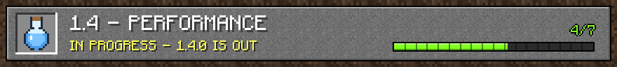

<details>
<summary><b>1.4 — performance</b> · in progress - 1.4.0 is out · 6 of 7 done</summary>

- [ ] Binary section messages instead of JSON with base64 (sections are already palette + run-length encoded and gzipped; measured on a 128-block view: 21 % fewer section bytes, 9 % of the whole gzipped stream, and the section cache already skips unchanged sections, so a second transport next to SSE is not worth it yet; lower priority)
- [x] **Section cache in the browser** (IndexedDB): the viewer keeps the sections it got; after "init" it tells the server which ones it has (position and a hash of the message) and the server answers "keep" for the unchanged ones, so reopening a camera downloads only what changed (`?cache=0` turns it off)
- [x] **Server memory**: far sections kept only as their message (a few KB instead of about 25), read back from it when a block or the light in them changes
- [x] **Per-section culling inside merged far regions**: each section of a merged region is checked against the frustum, the render distance and the occlusion graph and only the visible runs of sections are drawn (one multi-draw call per region with `WEBGL_multi_draw`)
- [x] **Entities skinned on the GPU**: every model's quads stay on the GPU in their parts' own space and a frame only sends one matrix per part (a float texture), so the vertices of mobs, players, armour and block entity models are no longer rebuilt and uploaded every frame (`?skinning=0` turns it off for comparisons)
- [x] Video wall: frame rate cap (lower for small tiles), one pixel per CSS pixel, no rendering for tiles that are off screen or in a hidden tab
- [x] **Budgets in CI**: server milliseconds per camera tick, bytes per section message, the page's time per frame (also in `/api/status`: tick time, sections sent, kept and compacted)

</details>

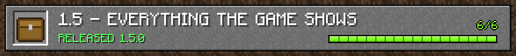

<details>
<summary><b>1.5 — everything the game shows</b> · released 1.5.0 · 6 of 6 done</summary>

- [x] **Display entities** like DisplayRenderer: block, item and text displays (the holograms, signs and decorations of servers) with their transformation interpolated like the game (Transformation.slerp), billboards facing the camera, brightness overrides, shadows, view range and teleport gliding; text displays with the game's font, colours, bold, italic, underline and strikethrough, line wrapping, alignment, background and see-through text (the cameras' own markers stay hidden)
- [x] **Shelves** like ShelfRenderer: the three items standing on a shelf, set on its middle by their model's bounding box or on its bottom when the shelf is powered
- [x] **Mannequins** drawn by the player renderer with the skin of their profile (by id or name, the default skin of the empty profile, or the texture, model and cape of the profile's skin patch), their hidden skin layers, poses and the description under their name
- [x] **Arrows and bee stingers stuck in players and mannequins** (StuckInBodyLayer): in the same body parts and places as in the game, from the same random seeded with the entity's id
- [x] Players drawn at the player renderer's scale (0.9375, they were a little too big); items whose model changes with the date (the Christmas chest) pick it by the viewer's clock
- [x] **Sulfur cubes** like SulfurCubeRenderer: their size, the small model of babies, the inner cube, the block they hold drawn inside them, and a primed cube swelling and flashing like TNT; slimes, magma cubes and sulfur cubes squash when they land and stretch when they jump; TNT swells like the game's; babies cast the smaller shadow of their age scale

</details>

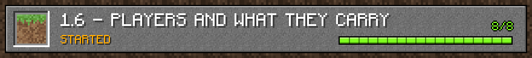

<details>
<summary><b>1.6 — players and what they carry</b> · released 1.6.0 · 8 of 8 done</summary>

- [x] **Parrots on players' shoulders** (ParrotOnShoulderLayer), sitting and looking where the player looks
- [x] **Heads and hats** (CustomHeadLayer): skulls and player heads with their owner's skin, carved pumpkins, banners and data packs' hats worn by players, mannequins, armour stands, humanoid mobs, villagers, illagers, piglins, copper golems and sulfur cubes, each at its renderer's place and size
- [x] **Items in use**: players and mannequins draw bows, charge and aim crossbows, raise shields (the blocking shield model), look through spyglasses, blow goat horns, brush and throw tridents with the game's arm poses (HumanoidModel), and their swing moves the arms and body like setupAttackAnimation
- [x] **Left-handed players and mobs**: the main hand's item in the left hand, the swing and the poses with the left arm
- [x] A riptide trident's spin (the player turning and SpinAttackEffectLayer's whirls) and deadmau5's ears
- [x] Shaking like the game: mobs frozen in powder snow, zombies, piglins and hoglins turning into something else, skeletons becoming strays and cold striders; sleepers lie along their bed; spiders, silverfish and endermites turn onto their backs when they die; Dinnerbone players only turn over while showing their cape
- [x] Shields without patterns were not drawn: the shield's plate uses the game's 26.3 textures
- [x] **Name tags like the game's**: the display name's colours and formatting (a team's colour, prefix and suffix, coloured custom names), the scoreboard's below_name objective under players' names, teams that hide name tags, no tag on a mob that is ridden, and the name_tag_distance and below_name_distance attributes

</details>

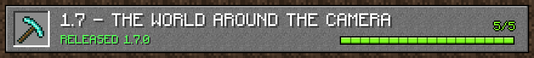

<details>
<summary><b>1.7 — the world around the camera</b> · released 1.7.0 · 5 of 5 done</summary>

- [x] **The world border** (WorldBorderRenderer): the scrolling force field on the border's walls within the render distance, fading in as the camera comes near, blue while it stands, green while it grows and red while it shrinks, and following the border as it moves
- [x] **Stacks on the ground** (ItemEntityRenderer.submitMultipleFromCount): bigger stacks show up to five copies, scattered by the game's seed for the item, flat items stacked front to back; every dropped item rests 1/16 above the ground by its model's real size
- [x] **Lingering potion and dragon's breath clouds** (AreaEffectCloud's client tick): the particles over the cloud's radius in the potion's colour, the few white and coloured puffs while it waits
- [x] **The wither's armour** at half health (WitherArmorLayer) and the charged creeper's aura drawn like EnergySwirlLayer: grey, scrolled by each layer's own offsets, and still shown on an invisible creeper
- [x] **Minecarts like AbstractMinecartRenderer**: sitting on their rail and tilted along slopes, rocking when hit, the block they carry at its display offset (lit furnaces, custom display blocks), TNT minecarts swelling and flashing on their fuse, and the id's tiny offset that keeps carts in one place from flickering

</details>

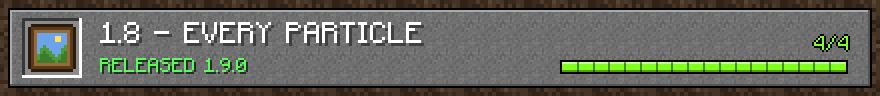

<details>
<summary><b>1.8 — every particle</b> · released 1.9.0 · 4 of 4 done</summary>

- [x] **Every particle type of 26.3** (ParticleResources): ash, white ash, crimson and warped spores, souls, sculk souls, charges and shrieks, vibrations flying to their listener, sonic booms, glow squids' glow and ink, squid ink, wax on and off, scrapes, electric sparks, enchanting glyphs, nautilus and vault connections, the totem of undying, gusts, dust plumes, dust changing colour, falling dust, snowflakes, spit, trails, trial spawner flames, fishing wakes, sneezes, mob growth specks and sulfur cube goo, with the game's physics, their quads turned like the game's (LOOKAT_Y, shrieks and vibrations) and glowing where they glow
- [x] **Level events' particles** (LevelEventHandler): splash and lingering potions bursting, dragon fireballs, eyes of ender breaking, dragon eggs and endermen teleporting, waxing, scraping and sparks on copper and lightning rods, sculk spreading and shriekers, a mace's smash, other players mining blocks, composters, trial spawners spawning, detecting and ejecting, cobwebs woven
- [x] **Entity events' particles**: a totem of undying saving someone, teleporting mobs, witches drinking; glow squids glowing all the time
- [x] **Biome ambient particles** (EnvironmentAttributes.AMBIENT_PARTICLES): the Nether's ash, white ash and spores and any data pack's, around the camera like ClientLevel.doAnimateTick

</details>

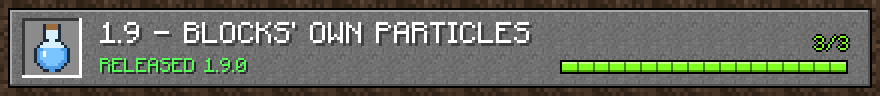

<details>
<summary><b>1.9 — blocks' own particles</b> · released 1.9.0 · 3 of 3 done</summary>

- [x] Enchanting tables' glyphs flying from bookshelves, ender chests' portal specks, redstone wire, repeaters' and lit ores' glowing dust, falling dust under sand, gravel and concrete powder, mycelium, end portals and gateways, brewing stands' smoke, wet sponges' drips and active sculk sensors
- [x] Conduits' nautilus specks drawn to the conduit, trial spawners' and vaults' flames and smoke, vaults opening and going out, bees dripping nectar, lightning rods' sparks in thunderstorms
- [x] Vaults' connections: specks flying from the players a vault is waiting for to its keyhole, and its flames only while it shows an item, from the vault's shared data like the game sends it

</details>

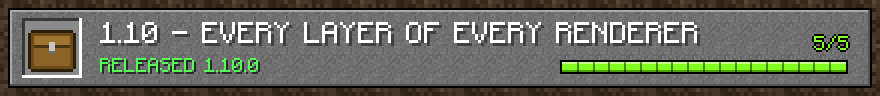

<details>
<summary><b>1.10 — every layer of every renderer</b> · released 1.10.0 · 5 of 5 done</summary>

- [x] Mooshrooms' mushrooms on their back and head (MushroomCowMushroomLayer) and snow golems' carved pumpkin (SnowGolemHeadLayer)
- [x] Villagers and wandering traders holding what they offer in their crossed arms (CrossedArmsItemLayer), witches' potions at their nose while they drink (WitchItemLayer) and dolphins carrying items (DolphinCarryingItemLayer); unhappy villagers shaking their heads
- [x] The warden's pulsating spots, its tendrils lighting up as it hears something and its heart beating faster as it gets angry (LivingEntityEmissiveLayer)
- [x] Vaults' spinning display item (VaultRenderer) and ominous item spawners' item growing and spinning (OminousItemSpawnerRenderer)
- [x] Cushions (CushionRenderer) and dragon fireballs (DragonFireballRenderer)

</details>

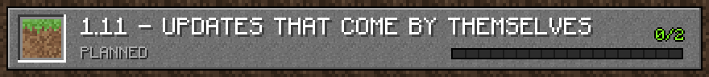

<details>
<summary><b>1.11 — updates that come by themselves</b> · released 1.12.0 · 2 of 2 done</summary>

- [x] **A weekly watch for new Minecraft releases** (`watch-minecraft`): as soon as Mojang releases a version Fabric supports, the update is tried on its own branch with the build and the server test, the game classes the viewer ports are compared, and an issue lists both results and what is left to do
- [x] The comparison summarised per viewer file: which ported classes changed, appeared or went away, grouped by the files of the viewer they are ported to, in the run's summary and the issue

</details>

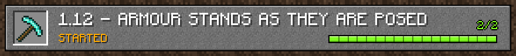

<details>
<summary><b>1.12 — armour stands as they are posed</b> · released 1.12.0 · 2 of 2 done</summary>

- [x] **Armour stand poses** (ArmorStandModel, ArmorStandArmorModel): the head, body, arms and legs turned as set with commands or in the world, the armour following them, arms and base plate only when shown, small stands, items held even without arms
- [x] Armour stands wiggle when hit (ArmorStandRenderer.setupRotations, entity event 32)

</details>

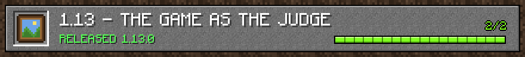

<details>
<summary><b>1.13 — the game as the judge</b> · released 1.13.0 · 2 of 2 done</summary>

- [x] **Reference renders of five shots**: the game (a client game test) and the viewer take pictures of the same scenes from the same eyes — day, night (the lightmap, torches, lanterns, the moon and stars), a row of mobs with their equipment, a room with block entities and smooth lighting, and under water — scored side by side in every CI run
- [x] Bounds for every shot, so a change (or a new Minecraft version) that moves the viewer away from the game shows up in CI; then close the gaps the new shots show: the water shot taken at full water vision like a camera sees, skeletons that only raise their bow when aggressive, and the block atlas's mip levels made like the game's MipmapGenerator (each texture's mipmap_strategy: mean, cutout, strict_cutout and leaves' dark_cutout, in linear light) — every shot now within 0.5 % of the game

</details>

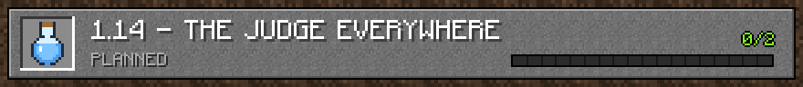

<details>
<summary><b>1.14 — the judge everywhere</b> · released 1.14.0 · 2 of 2 done</summary>

- [x] **Six more reference shots**: dusk towards the setting sun (the sunset colours in the sky and the fog), the day view in the rain (the rain, the darker sky and fog), a snowy plain while it snows (snowfall, a cold biome's colours, ice and powder snow, a snow golem and a polar bear), a cave lit only by blocks (the lightmap without sky light, glow lichen, amethyst, a spider's glowing eyes), a room in the Nether (its thick fog and ambient light, lava, magma and glowstone light, a portal, a piglin and a strider) and a platform in the End (its sky, flashes and fog, an end portal, purpur, a shulker); the scenes keep still (no mob spawning, no random ticks, time and weather stopped)
- [x] Bounds for the new shots, then close the gaps they show: the sunset glow without two wedges beside the sun (with a camera looking exactly along an axis the ends of the sunrise fan lay beside it and software renderers dropped them), snow golems' pumpkins facing forward (the carved pumpkin's default state) and the End's flashes standing still while the world's time does — every shot within 1 % of the game (0.6 % without rain or snow)

</details>

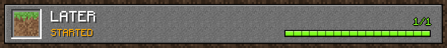

<details>
<summary><b>Later</b> · started · 1 of 1 done</summary>

- [x] **Recording and timelapse** of a camera in the browser: a video with the game's sounds, or one picture every second to five minutes turned into a video, with the camera's name, place and time burnt in

</details>

<sub>The pictures are pixel art drawn by `.github/scripts/roadmap.py` from docs/ROADMAP.md (no game textures); CI checks that they are up to date.</sub>
<!-- roadmap:end -->

## Requirements

- a **Fabric** server for Minecraft **26.3** (Fabric Loader ≥ 0.19.5),
- **Fabric API**,
- **Java 25**.

## Installation

1. Get `cctv-fabric-<version>.jar`:
   - from the **Releases** page of this repository (latest release), or
   - from the **Actions** tab (the `cctv-fabric` artifact of every build), or
   - build it yourself: `./gradlew build`. The jar ends up in `build/libs/`.
2. Put it into the server's `mods/` folder, next to Fabric API.
3. Start the server. The log shows `CCTV web server listening on http://0.0.0.0:8100/`.
4. Open port **8100/TCP** in your firewall or at your host. The port can be changed in the config.

On the first start the mod downloads the `client.jar` of the same game version from Mojang's
official servers (about 30 MB, once, stored in `config/cctv/assets/`), the same way launchers and
map renderers such as BlueMap do. Only textures, block models and mob model geometry are taken from
it for the browser (the geometry is cached in `entity-models-<version>.json.gz`, so it is not read
on every start). **Nothing is sent to players.** If the server has no internet access, put
`client.jar` into `config/cctv/assets/` yourself. You can also turn the download off
(`downloadClientAssets: false`); the viewer then uses plain colours. Sounds are game assets outside
`client.jar`: the server downloads each one from Mojang the first time a viewer plays it and keeps it in
`config/cctv/assets/objects/` (like the launcher); `sounds: false` turns this off.

## Commands

They need operator permissions (level 2). Anyone can use `list` and `url`.

| Command | Description |
|---|---|
| `/cctv create <name>` | Places a camera at your eye height, looking where you look |
| `/cctv create <name> <x y z> [<yaw> <pitch>]` | Camera at the given position (`~ ~ ~` = your eye height, `^ ^ ^` relative to your eyes) |
| `/cctv move <name> [<x y z> [<yaw> <pitch>]]` | Moves a camera (to your position by default) |
| `/cctv aim <name> [<x y z>]` | Points a camera at a position (at you by default) |
| `/cctv fov <name> <degrees>` | Field of view (10–140°, default 70) |
| `/cctv range <name> <blocks>` | View distance (16–`maxRange`, default 96) |
| `/cctv remove <name>` | Removes a camera |
| `/cctv list` | Lists cameras with clickable links |
| `/cctv url [<name>]` | Link to the viewer |
| `/cctv info <name>` | Camera details |
| `/cctv reload` | Reloads the viewer settings (`viewer`), shaders and sky boxes |

In game a camera shows up as a small observer block (a `block_display` entity that every vanilla
client can see). Turn this off with the `markers` option. `execute in <dimension> run cctv create ...`
works too.

Live content (mobs, block changes, light) comes from **loaded chunks**. Terrain further away
(`farTerrain`) is read from the saved world files without loading chunks and refreshed from time to
time. If a camera should show movement while nobody is nearby, keep the area loaded, e.g.
`/forceload add <x1> <z1> <x2> <z2>`.

## Browser viewer

- `http://SERVER-IP:8100/` shows the camera list and a **video wall** (all cameras at once).
- `http://SERVER-IP:8100/cam/<name>` shows a single camera.

Drag with the mouse to look around, use the wheel to zoom and double-click to go back to the
camera's view. The view turns only as far as the terrain the server streams around the camera's
direction (about 20° beyond the picture); aim the camera with `/cctv aim` to look elsewhere. **⚙ Settings** has: graphics (vanilla / shaders) and shader quality, field of view
(30–110° like the game's option, or the camera's own), distance fog (the game's, smooth, atmospheric or
minimal), biome blend (off to 15×15 like the game's option), background music and its Now Playing toast, post effect
(custom shader), sky (sky box), clouds, camera mode (colour / black and white / night vision),
render resolution (for weak GPUs), name tags, mob labels, particles and the CCTV effect. Each viewer's
choice is remembered in their browser.

**⏺ Record** saves a video of the camera (with the game's sounds when they are on) and **⏱ Timelapse**
keeps one picture every second to five minutes (Settings) and turns them into a video when it is stopped. The
camera's name, place, date and game time are burnt into the corner like on a CCTV recording. Everything is
recorded in the viewer's own browser (WebM, with the length set so players can seek); `recording: false`
hides both buttons.

Name tags look exactly like in the game: Minecraft's own font from `client.jar`, floating half a
block above the head at the game's scale, with the translucent background, lit like the entity and
dimmed for sneaking players. They follow the game's rules (players within 64 blocks, 32 when
sneaking; mobs whose custom name is set to always show) and are only drawn for entities the camera
can really see. "Mob labels" adds tags for every other mob (its custom name or its type).
The pages themselves — the camera list, the HUD, the buttons and the settings — are written in the same font:
the server builds a web font from the game's glyph sheets (and a bold one like the game's bold), so resource
packs that change the font change the pages too.

### Shaders, post effects and sky boxes

- **"Shaders" graphics** works in any browser with WebGL2: shadows from the sun and the moon,
  waving leaves and grass, waves and reflections on water, glowing bright blocks and sun rays. The
  quality (low–ultra) changes the shadow resolution and distance.
- **Post effects**: files `config/cctv/shaders/<name>.glsl` with a `vec4 postProcess(vec2 uv)`
  function (available: `uScene`, `uDepth`, `uResolution`, `uTime`, `uDaylight`, `uRain`,
  `linearDepth(uv)`). The examples `sepia.glsl` and `security-camera.glsl` are copied on the first
  start.
- **Sky boxes**: a folder `config/cctv/skyboxes/<name>/` with six faces `px nx py ny pz nz`
  (png/jpg/webp) or a single panorama `config/cctv/skyboxes/<name>.jpg`, optionally with
  `<name>.json` holding `brightness`, `followDaylight`, `rotateWithSun`, `showSun`, `showClouds`
  (see `config/cctv/skyboxes/README.txt`). A `sunset` panorama is included as an example.
- **Defaults for everybody**: the `viewer` section in `config.json` (e.g.
  `"viewer": {"graphics": "shaders", "skyboxes": {"minecraft:overworld": "sunset"}, "postShader": "sepia"}`),
  then `/cctv reload`. `lockSettings: true` stops viewers from changing them.

## Configuration – `config/cctv/config.json`

| Key | Default | Description |
|---|---|---|
| `bindAddress` | `0.0.0.0` | Web server address |
| `port` | `8100` | Web server port |
| `accessToken` | `""` | When set, the viewer needs `?token=...` (remembered in a cookie). Operators get a link with the token from `/cctv url` |
| `publicUrl` | `""` | Address used for links in chat, e.g. `http://mc.example.com:8100` |
| `defaultFov` / `defaultRange` / `maxRange` | `70` / `96` / `512` | Settings for new cameras (`maxRange` up to 1024) |
| `farTerrain` | `true` | Terrain in unloaded chunks is read from the region files (long view distance) |
| `entityRange` | `128` | How far away entities are sent |
| `entityUpdateTicks` | `1` | Send entities every N ticks (1 = 20×/s) |
| `sectionsPerTick` | `96` | How many 16³ sections a camera may copy per tick while loading |
| `workerThreads` | half the cores (1–4) | Threads that decode sections and read world files off the main thread |
| `rescanSeconds` | `5` | Full re-check of the area every N seconds (safety net) |
| `downloadClientAssets` | `true` | Download textures/models from Mojang's `client.jar` |
| `language` | `en_us` | Language of mob names in the viewer (`pl_pl`, `de_de`…; downloaded from Mojang once) |
| `worldResourcePacks` | `true` | Use the world's own packs: assets in `<world>/datapacks` and `<world>/resources.zip` |
| `serverResourcePack` | `true` | Download the `resource-pack` of `server.properties` (checked against its SHA-1) and use it |
| `modAssets` | `true` | Use the assets of the server's mods (sounds, textures, texts) like the client's mod resource packs, e.g. the songs of The Immersive Music Mod |
| `gzip` | `true` | Compress the stream |
| `skins` | `true` | Player skins (the server fetches them from the Mojang API and caches them) |
| `sounds` | `true` | The game's sounds in the viewer (files downloaded from Mojang when first played, cached) |
| `recording` | `true` | The Record and Timelapse buttons (videos are made in the viewer's browser, nothing on the server) |
| `markers` | `true` | Camera marker block in the world |
| `maxViewersPerCamera` | `16` | Viewer limit per camera |
| `viewer` | | Viewer defaults: `graphics` (`vanilla`/`shaders`), `shaderQuality` (`low`…`ultra`), `postShader`, `skyboxes` (dimension → name), `clouds` (`fancy`/`fast`/`off`), `labels`, `mobLabels`, `particles`, `mode` (`color`/`mono`/`night`), `cctvEffect`, `fog` (`vanilla`/`smooth`/`atmospheric`/`minimal`), `fov` (30–110, 0 = each camera's), `biomeBlend` (0–7), `music` (`off`/`default`/`frequent`/`constant`), `musicToast` (`on`/`off`), `lockSettings` |

The viewer uses the same packs as the players, lowest priority first:

1. the assets in the server's mods (`modAssets`), like the client's mod resource packs,
2. the assets of the world's data packs (`<world>/datapacks/*`, zipped or unpacked),
3. the world's own `resources.zip`,
4. the server resource pack from `server.properties` (downloaded once into `config/cctv/assets/server-packs`),
5. everything in `config/cctv/resourcepacks/` (`*.zip` or unpacked folders), sorted by name.

So custom content looks and sounds like it does in the game: blocks and items, **custom paintings** of
data packs (their pictures come from the packs' `textures/painting/`), **custom music discs** (the
data pack's `jukebox_song` with its sound from the pack's `sounds.json`, and its description in the
"Now Playing" line), items with their own `item_model`, mob textures, sounds and languages. Packs are read when the server starts.

**The Immersive Music Mod** (TIMM) needs nothing more than being installed on the server: its songs are read
from the mod's jar (they are not copied anywhere), its playlists and settings from `config/timm/` like the mod
reads them (else the mod's own), and the viewer plays them the way the mod does: each biome's list, fading out a
few seconds after the camera's biome stops having the song, and the song of a structure the camera is in.

## How it works

<p align="center">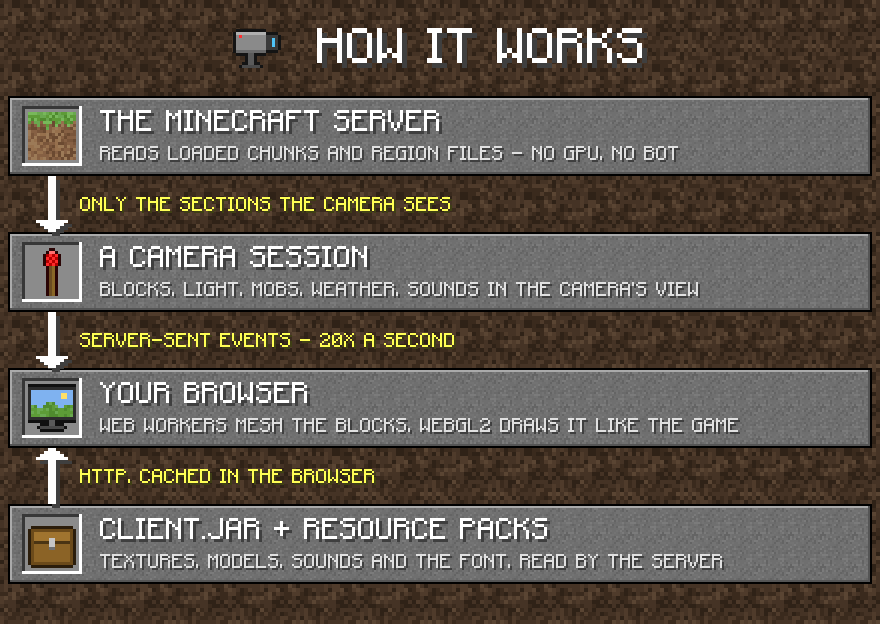</p>

- Data flows over **Server-Sent Events** (plain HTTP, works through proxies and nginx).
- The server never loads chunks: it reads loaded ones and takes the rest from the saved files (the
  server's IO thread plus the mod's worker threads). The main thread only copies section data;
  decoding, compression and JSON happen elsewhere. Empty air and far sections hidden inside the
  ground are not sent (a section counts as hidden only when it lies below the surface of its own
  chunk and of the neighbouring chunks towards the camera, so cliffs and hillsides stay complete;
  nothing is skipped while the camera itself is underground).
- A viewer gets the world as fast as its connection takes it: new sections wait while earlier ones
  are still queued, so slow connections never overflow and restart.
- The browser keeps the sections it received (IndexedDB, up to 60 000 sections). Reopening a camera,
  or another camera in the same dimension, downloads only the sections that changed since; the rest
  come from the browser's cache. `?cache=0` in the camera link turns this off.
- Sections far from the camera are kept in memory only as the message the viewers get (a few KB each);
  `GET /api/status` shows each camera's time per tick and how many sections it sent, kept from browsers'
  caches and compacted.
- Server cost per camera with viewers: a one-time copy of the sections (spread over ticks), the
  entity list in the camera's range every tick and a few to a few dozen KB/s per viewer (depending
  on the number of entities). A camera without viewers costs nothing (its cache is released after a
  minute).
- The picture is about 100–150 ms behind (a buffer that smooths entity movement).

## API (to build your own page)

All endpoints support CORS and `?token=` (when a token is set).

| Endpoint | Content |
|---|---|
| `GET /api/cameras` | Camera list (JSON) |
| `GET /api/cameras/{name}/stream` | SSE stream, events below; `?cache=1` for a viewer with a section cache |
| `POST /api/cameras/{name}/cache?vid=&epoch=` | The cached sections as `x,y,z,hash,…` (hash: cyrb53 of the section message), after `init` |
| `GET /assets/bundle.json` | Block states, block models and textures (from client.jar) |
| `GET /assets/models.json` | Mob model geometry (layers from `LayerDefinitions`) |
| `GET /assets/entities.json`, `/assets/entity/{path}.png` | Mob textures |
| `GET /assets/misc/{path}.png` | Textures of `textures/misc` (the entity shadow) |
| `GET /assets/painting/{name}.png` | Paintings (`{namespace}:{name}` for the paintings of data packs) |
| `GET /assets/font/{path}` | The game's font (`default.json`, glyph sheets such as `ascii.png`) |
| `GET /assets/font/minecraft.ttf`, `minecraft-bold.ttf` | The game's font as a web font, built from its glyph sheets (the pages use it) |
| `GET /assets/music.json` | Song titles for the Now Playing toast; The Immersive Music Mod's playlists |
| `GET /assets/gui/{path}.png` | GUI sprites (the Now Playing toast) |
| `GET /api/viewer` | Viewer defaults, list of shaders and sky boxes |
| `GET /custom/shaders/{name}.glsl`, `/custom/skyboxes/...` | Shader and sky box files from `config/cctv` |
| `GET /skin/{uuid}?name=` | Player skin (PNG, `X-Skin-Model` header) |
| `GET /cape/{uuid}?name=` | Player cape (PNG, 404 without a cape) |

Stream events:

- `init`: `{camera:{name,dimension,x,y,z,yaw,pitch,fov,range}, sections, biomes:{id:{t,d,w,g?,f?,m}}, entityTicks,
  dim:{id,skybox,cardinal,hasSky,ambient,endFlashes,minY,height,horizon,zoomSeed}, vid?, epoch?}`; the world is sent from scratch
  after it (with `?cache=1` it waits up to 3 s for the cache manifest of this `vid` and `epoch`);
- `progress`: `{d, t}` loading progress;
- `palette`: `{s:[{id, n:"minecraft:oak_stairs", s:"facing=north,…", c:mapColor, f:flags, b:[[x0,y0,z0,x1,y1,z1]…], l:light, lv:fluid level, tg?:[block tags]}]}`;
- `section`: `{x,y,z, p:[id…], r:RLE, sl:sky light RLE, bl:block light RLE, bp:[biomes], bi:4³ indices}`,
  where RLE is base64 of varint pairs `(length, value)` in YZX order;
- `keep`: `{k:[x,y,z,…]}`, cached sections that did not change (shown from the cache instead of a `section`);
- `blocks`: `{b:[[x,y,z,id]…]}`, instant block changes;
- `entities`: `{t:tick, e:[{id,type,x,y,z,yaw,pitch,body,head,w,h,age,walk,walkSpeed,scale?,name?,uuid?,pose?,sneak?,baby?,
  hurt?,dead?,swing?,hand?,offhand?,saddle?,bodyArmor?,armor?,item?,seed?, d:{variant?, markings?, villager?, color?, …}}]}`;
- `env`: environment attributes at the camera: `{time, clock, gt, rain, thunder, sky, fog, sunrise, cloud, cloudHeight, sunAngle,
  moonAngle, starAngle, stars, moonPhase, skyLight, skyFactor, ambient, blockTint, fogStart, fogEnd, skyFogEnd, …, flash?,
  amb?:{loop?, mood?:[sound, tickDelay, extent, offset], add?:[[sound, chance]…]}, creaking?, fireflies?}`;
- `weather`: rain/snow columns around the camera `{x, z, size, minY, h:[heights], p:"rsn…"}`;
- `ready`: the whole visible area has been sent;
- `removed`: the camera was removed.

## Development

- The plan: [docs/ROADMAP.md](docs/ROADMAP.md). Moving to a new Minecraft version:
  [docs/UPDATING.md](docs/UPDATING.md).
- The roadmap on this page (pictures and lists) is generated from docs/ROADMAP.md: run
  `python3 .github/scripts/roadmap.py` after editing it. CI fails when it is out of date.
- `GET /api/status` shows the live camera sessions (how far each viewer got, queued messages) when
  something does not stream as expected.
- New release: bump `version` in `gradle.properties`, add notes in `docs/release-notes/v<version>.md`
  and push the tag `v<version>` or run the `release` workflow by hand in the Actions tab. The
  workflow builds the mod, creates the tag and publishes the release with the jar.
- The web page lives in `src/main/resources/web/` (plain JS, no bundler, no libraries).
- Start the server with `-Dcctv.webDir=/path/to/src/main/resources/web` to see changes to the page
  after a refresh, without a restart.
- CI (`.github/workflows/build.yml`) builds the mod, starts a real 26.3 server with it and places a
  camera over RCON. It checks the stream (sections, light, entities 20×/s, instant block changes),
  the assets and entity models, then takes screenshots of the viewer in Chromium, vanilla and
  shaders (artifact `server-test`).
- **Reference renders** (`reference-renders` job): a Fabric client game test (`src/gametest`) starts the real
  game under a virtual display, builds a scene in single player and takes the game's picture from a spectator's
  eyes; a camera at the same eyes is opened in the viewer (`?clean`, without the overlay) and both pictures go
  side by side with a difference score into the job summary and the `reference-renders` artifact. Run it locally
  with `./gradlew runClientGameTest` while `node .github/e2e/reference.mjs build/run/clientGameTest/reference`
  waits for the game.

## Limitations

- Terrain in unloaded chunks shows the state of the last world save.
- Textures and models from `client.jar` are not part of this repository. The mod downloads them
  from Mojang's servers on a server that runs the game.

## FAQ

<details>
<summary><b>Do players need to install anything?</b></summary>

No. The mod runs only on the server; players join with a normal vanilla client and the cameras are
watched in a browser.
</details>

<details>
<summary><b>How much does a camera cost the server?</b></summary>

About a millisecond per tick while somebody watches it (`GET /api/status` shows the exact time for each
camera), a few to a few dozen KB/s per viewer, and nothing while nobody watches. The heavy work
(meshes, lighting, drawing) is done by the browser.
</details>

<details>
<summary><b>Can I show it on a website or a stream overlay?</b></summary>

Yes: `http://your-server:8100/cam/<name>?embed=1` is a bare picture for an `<iframe>` or OBS browser
source, and the [API](#api-to-build-your-own-page) lets you build your own page. Set `accessToken` to
keep the cameras private.
</details>

<details>
<summary><b>My server uses a resource pack or data packs with custom content. Does it show up?</b></summary>

Yes. The world's data packs, its `resources.zip` and the server resource pack of `server.properties` are
used like the game uses them, so custom paintings, music discs, blocks, items and sounds appear in the
viewer too. Extra packs go into `config/cctv/resourcepacks/`.
</details>

<details>
<summary><b>How hard is it to update to a new Minecraft version?</b></summary>

Most of the game data (models, textures, animations, entity renderers, sounds, languages) is read from the
new `client.jar` automatically. [docs/UPDATING.md](docs/UPDATING.md) walks through the rest, and the
`inspect-minecraft` workflow compares the game classes the viewer ports between two versions.
</details>

## License

MIT – see [LICENSE](LICENSE). Minecraft is a trademark of Mojang/Microsoft. This mod is not
affiliated with Mojang.
